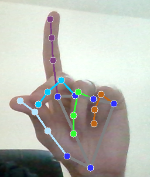
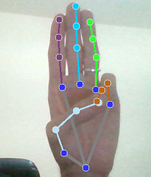
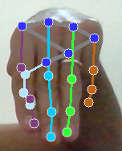

# Handy Input

## Índice
1. [Introdução](#introdução)
2. [Instalação](#instalação)
    - [Pré-Requisitos](#pré-requisitos)
    - [Download do Projeto](#download-do-projeto)
    - [Configuração do Ambiente Virtual](#configuração-do-ambiente-virtual)
3. [Uso](#uso)
    - [Mover o Cursor](#mover-o-cursor)
    - [Clicar](#clicar)
    - [Arrastar](#arrastar)
    - [Clicar com Botão Direito](#clicar-com-botão-direito)
    - [Scroll](#scroll)
4. [Demonstração](#demonstração)

## Introdução

Este projeto utiliza a biblioteca **MediaPipe Hands** para criar um sistema de controle de mouse por gestos, transformando gestos de mão capturados pela webcam em comandos de movimento e clique. Usando **OpenCV** para capturar as imagens da câmera, o programa detecta e interpreta gestos específicos que permitem ao usuário executar ações básicas e avançadas com o cursor, como:

* Mover o cursor
* Clicar com o botão esquerdo e direito
* Arrastar
* Scrollar

A ideia é oferecer uma experiência interativa e intuitiva de controle, onde a mão funciona como um "trackpad virtual", permitindo a navegação sem a necessidade de periféricos físicos.

## Instalação

Para garantir que todas as dependências do projeto sejam instaladas corretamente e que não haja conflitos com outras bibliotecas do sistema, recomenda-se o uso de um ambiente virtual. Siga os passos abaixo para configurar o ambiente:

**Esse guia de instalação foi feito para Linux Ubuntu. Os comandos podem ter alguma variação em outros sistemas operacionais.**

### Pré-requisitos

* Certifique-se de que você possui o **Python 3.12** ou superior instalado em sua máquina. Você pode verificar a versão do Python instalada executando o seguinte comando no terminal:

```
python --version
```

ou

```
python3 --version
```

* Certifique-se também que você possui o **python3-venv** instalado.

Para instalá-lo **(Linux Ubuntu)**:

```
sudo apt install python3-venv
```

### Download do Projeto:

Clone o repositório usando o comando:

```
git clone https://github.com/CantarinoG/handy-input.git
```

### Configuração do Ambiente Virtual:

* Para criar um ambiente virtual, execute o seguinte comando estando no diretório do projeto:

```
python -m venv env
```

ou

```
python3 -m venv env
```

* Para ativar o ambiente virtual, execute o comando:

```
source env/bin/activate
```

* Para instalar as dependências do projeto, execute o comando:

```
pip install -r requirements.txt
```

## Uso

Para executar o projeto, execute o comando:

```
python src/main.py
```

Pressione <kbd>Ctrl</kbd> + <kbd>C</kbd> no terminal para encerrar a execução.

Os gestos devem ser feito com a palma da mão na direção da webcam, numa distância entre cerca de 30cm a 60cm.

Sua experiência pode variar de acordo com fatores como iluminação e qualidade de imagem da webcam.

### Mover o cursor

Para mover o cursor, mova a mão enquanto faz o seguinte gesto:


O dedo indicador deve estar esticado e reto, enquanto os demais dedos estão dobrados.

### Clicar

Para clicar na tela, a partir do gesto de movimento, junte a ponta do dedo indicador com a ponta do polegar:


### Arrastar

Para arrastar, mantenha o gesto de clicar por um tempo. Uma vez que estiver arrastando, basta manter esse gesto enquanto move a mão. Para soltar, volte a mão para o gesto de mover o cursor.

### Clicar com Botão Direito

Para clicar na tela com o botão direito, a partir do gesto de movimento, junte a ponta do dedo médio com a ponta do polegar:



### Scroll

Para scrollar para cima, os dedos indicador, médio e anelar devem estar esticados, retos, para cima, enquanto o midinho e o polegar estão dobrados:



Para scrollar para baixo, faça a mesma posição, porém apontando para baixo:



## Demonstração

Um vídeo de demonstração do projeto em execução pode ser visto [aqui](./docs/demo.mp4).